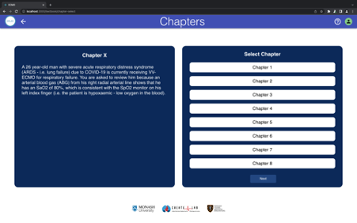
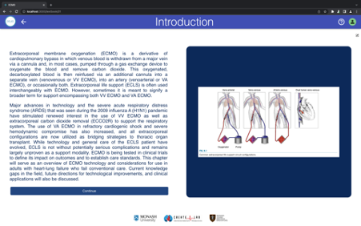
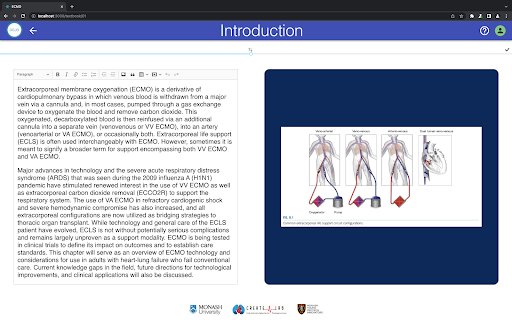
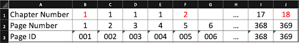
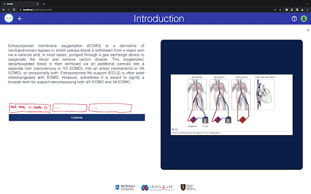

# Front-end

This project was bootstrapped with [Create React App](https://github.com/facebook/create-react-app).

## Dependencies

- [React](https://reactjs.org/)
- [Pulse Physiology Engine](https://pulse.kitware.com/)
- [DynamoDB](https://aws.amazon.com/dynamodb/)
- [Node.js](https://nodejs.org/en/) & [ExpressJS](https://expressjs.com/)

## System Structure

Currently the folder structure for the system follows:

```
/ecmo [frontend]
/ecmo_backend [backend]
/Testing [QA testing]
```

## Folder Structure

```
/public
    /unitybuild [used to include unity model into the application]
/src
    /components [contains different reusable UI components]
    /pages [contains different pages in the application]
    /routes [page routing]
    /shared [used for application-wide assests, styling and etc.]
```

## Installation

To get the development environment running on the frontend follow these steps:

```
cd ecmo/src
npm install
```

## Running the app

```
cd ecmo/src
npm start
```

Runs the app in the development mode.<br />
Open [http://localhost:3000](http://localhost:3000) to view it in the browser.

The page will reload if you make edits.<br />
You will also see any lint errors in the console.

## Deployment

```
npm run build
```

Builds the app for production to the `build` folder.<br />
It correctly bundles React in production mode and optimizes the build for the best performance.

The build is minified and the filenames include the hashes.<br />
Your app is ready to be deployed!

See the section about [deployment](https://facebook.github.io/create-react-app/docs/deployment) for more information.

<!-- ## Known Issues -->

<!-- ## Troubleshooting FAQ -->

## Features Planned

- Implementation of additional modules of Pulse Physiology Engine (Currently only have pump functionality)
- Allow option to convert scenario training into E-assessment and E-Vigilation platform
- User authentication: Admin, student and e-invigilator
- Add content to textbook and scenarios
- Integrate pulse physiology engine on the free play model

<!-- ## Internal links -->

# Textbook

1. Textbook Introduction
    1. The textbook application is one of the three core functions of the ECMO application. Currently, an example chapter has been included. Documentation will be provided on how to extend and modify each part of the textbook. There will be suggested todos for each part of the system, but the suggestions are not guaranteed to be the most optimal approach.
    
2. ChapterSelect Page
    1. When you first select the textbook mode, you are presented with the ChapterSelect page (Path: host/textbook/chapter-select) <br/>
    <br/>
    2. https://bitbucket.apps.monash.edu:8443/projects/ARVR/repos/fit4002-ecmo-sim-training/browse/ecmo/src/pages/TextBook/ChapterSelect/ChapterSelect.js?at=develop#33-41<br/> 
    The ChapterSelect page consists mainly of the ChapterSceneSelector component which consists of two Card components, one on the left and another on the right. The left Card houses chapter description and a header for chapter number. The right Card houses the ScrollingList component which allows the user to select from a set of chapters. Currently, data for both the left and right Card are hardcoded.
    3. Props isTextbook and isScenario are inverse of one another. It is currently only used for determining the text to be displayed on the cards, ‘Select Chapter’ vs ‘Select Scenario’. Further functionality could be added.
    4. Prop buttonLinkTo determines the path of the next button on the right card.
    5. Suggested Todos: 
        1. A useEffect hook could be used in ChapterSelect.js to call an API that returns a list of objects containing chapter numbers as well as their descriptions. This return data could then be passed to the ChapterSceneSelector component with a few modifications.
        2. For the left card, descriptions of all chapters could be rendered but hidden. Using the useState hook, you could selectively unhide a single selected chapter description.
        3. Update the buttonLinkTo prop for the ChapterSceneSelector component so the next button click will be routed to the correct page. It is currently hardcoded to page 01.
        4. If state management is employed with user roles, the ScrollingList could be extended to show which chapters has already been completed.
        
3. Textbook chapter (ConfigurablePageA Page)
    
    1. <br/>After selecting a chapter, this is the beginning of the textbook chapter proper. The page component being used is ConfigurablePageA.
    2. It is named as ConfigurablePageA as initially, it was proposed that there be up to 4 different page layouts.
    3. <br/>The page is split into two containers. The width of these containers can be adjusted using a slider once in the ‘edit mode’. Both containers can also be swapped by clicking the icon with two arrows above the slider. To enter ‘edit mode’, click on the pencil and square icon on the top-right of the page.
    4. https://bitbucket.apps.monash.edu:8443/projects/ARVR/repos/fit4002-ecmo-sim-training/browse/ecmo/src/pages/TextBook/ConfigurablePageA/ConfigurablePageA.js?at=develop#153-160 <br/>
    The width of each container is determined by the sliderValue while the contents of each container is determined by a boolean mirrorLayout.
    5. Text contents are editable in ‘edit mode’ using a WYSIWYG editor. Editor used is CK Editor 5, refer to it’s documentation if further information is needed.
    6. Currently, there is no functionality for image replacement.
    7. To exit ‘edit mode’, click on the tick icon on the top-right of the page. Currently, changes are not saved when exiting ‘edit mode’.
    8. Currently, the contents of the textbook are hardcoded. The mock data being used is housed in the mockdata.js file located in ecmo/src/pages/textbook/ConfigurablePageA/mockdata.js. The DynamoDB table and API routes are already set up for textbook contents.
    9. The data structure of the textbook data can be referenced from mockdata.js. Some things to note:
        1. text_content is a string of HTML text. This is parsed on the front-end using the library ‘html-react-parser’ before render.
        2. button_link_to is a string that determines the next page, or where the ‘Continue’ button on each page routes to. In the case of an empty string, the button label will be ‘Finish’ and the ‘Finish’ button will route to the textbook chapter select page.
        3. Suggested structure for Page ID and Page Numbers, with beginning of chapters in red. 
        
        <br/> We suggest using a continuous page numbering system that does not reset with an increment of chapter number. Either Page Number or Page ID could be used as the primary key and for routing of textbook pages.
    10. Suggested Todo:
        1. Pull contents of textbook from DynamoDB
        2. User roles to only allow admin or superusers to enter ‘edit mode’
        3. Add functionality to replace current image
        4. Save text and image contents when exiting ‘edit mode’
        5. Add hyperlinks to relevant sections of the textbook (as requested by client, double check with clients if this is still relevant). <br/>
        6. New page for non-technical medical academics to ‘add page to textbook’, Suggested input fields:
            1. Text Content
            2. Image Content
            3. Chapter Number
            4. Page Number